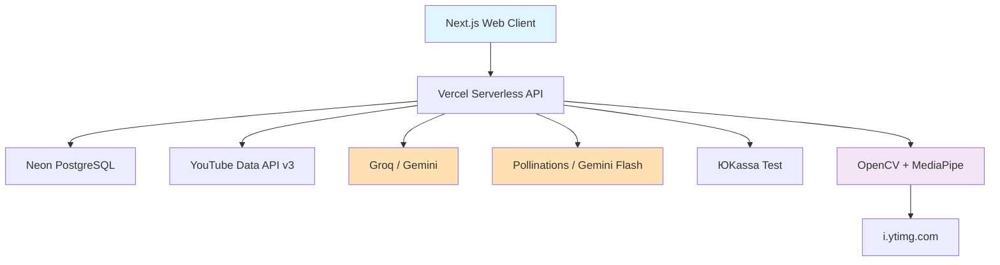
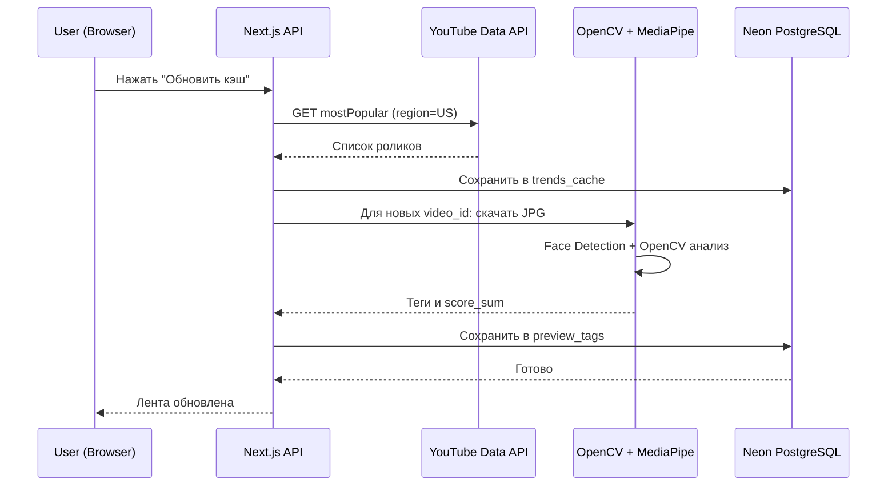
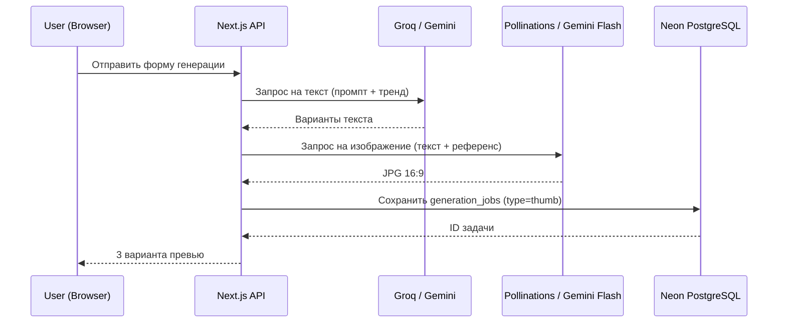

# План архитектуры

## 1. Общая архитектура системы

YT Pulse построен по разделённой 3-звенной архитектуре: Клиент (Next.js), Сервер (Vercel serverless + Neon), Внешние сервисы (YouTube, AI, Платежи).



## 2. Компоненты системы

### 2.1. Frontend Components

#### **🌐 Web Client (Next.js App Router)**
- **Назначение**: Пользовательский интерфейс кабинета
- **Технологии**: Next.js, React, TailwindCSS
- **Ответственность**:
  - Экраны входа и регистрации (тёмная тема)
  - Лента трендов с фильтрами (сетка 3 колонки)
  - Экран "Превью" (список, кадр, теги)
  - Экран "Генерация" (форма + варианты)
  - Экран "Очередь" (статусы + плеер-заглушка)
  - Личный кабинет (4 вкладки)
  - Экраны тарифов и оплаты

### 2.2. Backend Components

#### **⚙️ Backend Core (Next.js API Routes)**
- **Назначение**: Serverless API, точка входа
- **Технологии**: Next.js API Routes, Vercel Hobby
- **Ответственность**:
  - Маршрутизация запросов от клиента
  - Проксирование к внешним API (YouTube, AI, ЮKassa)
  - Управление сессиями пользователей
  - Фоновые задачи: обновление кэша трендов и разбор превью

#### **🧠 Preview Analysis Engine (`preview_engine.ts`)**
- **Назначение**: Локальный разбор JPG-превью
- **Ответственность**:
  - Скачивание обложек с `i.ytimg.com`
  - Вызов MediaPipe Face Detection (площадь лица ≥ 12%)
  - Вызов OpenCV (контраст σ ≥ 55, текстовая зона ≥ 8%, центр объекта)
  - Подсчёт `score_sum` и запись в `preview_tags`
  - Запуск только при обновлении кэша, не на каждый клик

#### **💾 Database Service (Neon PostgreSQL)**
- **Назначение**: Хранение данных
- **Технологии**: Neon.tech PostgreSQL (free tier)
- **Ответственность**:
  - Таблица `users` — авторизация, план, срок Pro
  - Таблица `trends_cache` — кэш `mostPopular` по фильтрам
  - Таблица `preview_tags` — результаты разбора превью
  - Таблица `generation_jobs` — задачи на генерацию превью/видео
  - Таблица `payments` — история тестовых платежей + webhook payload

### 2.3. AI Components

#### **📡 LLM Client (`llm_client.ts`)**
- **Назначение**: Генерация текста через Groq или Gemini
- **Протокол**: HTTP REST API
- **Особенности**: Ретраи, запасной провайдер, стриминг статусов на UI

#### **🖼 Image Generation Client (`image_client.ts`)**
- **Назначение**: Генерация превью через Pollinations или Gemini Flash Image
- **Особенности**: 3 варианта 16:9, визуальный уровень соответствует референсу

#### **🎬 Video Generation Adapter (`video_adapter.ts`)**
- **Назначение**: Контракт "создать задачу, узнать статус, получить файл"
- **Приоритет**: Luma Ray API → fal.ai / PiAPI → DashScope → FFmpeg Ken Burns → заглушка

## 3. Взаимодействие компонентов

### 3.1. Последовательность обновления трендов и разбора превью



### 3.2. Последовательность генерации превью (Pro)



## 4. Потоки данных

### 4.1. Трендовые данные
```
YouTube API -> Next.js API -> Парсинг JSON -> Фильтрация (6 фильтров) ->
trends_cache (Neon) -> Триггер разбора -> i.ytimg.com ->
OpenCV + MediaPipe -> preview_tags (Neon) -> UI
```

### 4.2. Генерация контента
```
Выбор тренда -> Форма генерации -> Groq/Gemini (текст) ->
Pollinations/Gemini Flash (изображение) -> generation_jobs (Neon) -> UI
```

### 4.3. Платежи
```
Выбор тарифа -> ЮKassa Test Widget -> Платёж -> Webhook ->
payments (Neon, raw payload) -> Обновление users.plan = pro -> UI
```

## 5. Масштабируемость и расширяемость

### 5.1. Горизонтальное масштабирование
- Frontend хостится на Vercel Edge Network (CDN)
- Backend — serverless functions, масштабируются автоматически
- Neon PostgreSQL поддерживает read replicas при переходе на платный план

### 5.2. Расширение функциональности
- Замена FTS5-подобного поиска на семантический (векторная БД) при усилении моделей
- Подключение боевой ЮKassa и автопродления
- Добавление новых регионов (не только US)
- Интеграция полноценного video-to-video API (Runway, Kling) вместо заглушки

---

*Документация подготовлена для проекта YT Pulse*

---
